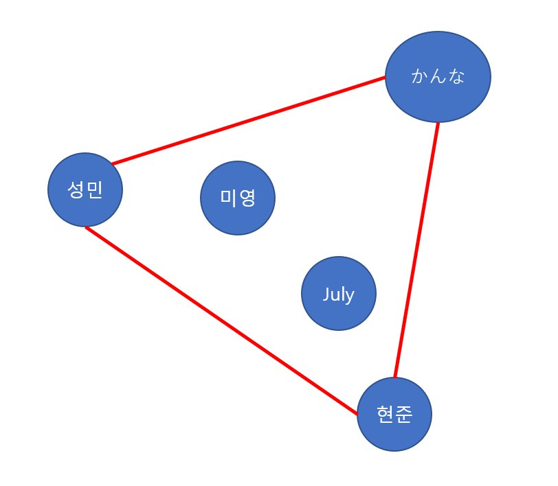

# 준호의 어장관리 시스템
for 500 points solved by 0

### Description

준호의 어장관리 시스템

충남대 인기남 신준호는 인기가 매우 많다.
그는 어느 한 명도 사귀고 싶지않았지만, 그는 자신을 좋아하는 사람들에게 상처를 주지 않기위해
어장을 관리하고있다.
준호의 어장에 n명의 애인들이 있다.

어느 날, 준호는 애인들을 조금 더 효율적으로 관리하기위해 지도에 애인들의 위치를 표시하기로 했다.

위치를 표시한 후,
몇개의 위치를 골라 다각형을 만드려하는데,
이때 각 애인들의 위치를 이은 선분이 항상 다각형의 내부에 존재하게 하려한다.
또 모든 애인들이 다각형 내부에 포함되게 하려한다.
다음은 애인이 5명인 경우의 한 예이다.

애인들의 위치가 주어졌을 때, 다각형을 이루는 위치(점)의 개수를 구하는 프로그램을 작성하시오.

<입력>
첫째 줄에 애인들의 수 (3<=n<=100,000)이 주어진다.
둘째 줄부터 애인들의 x좌표와 y좌표가 빈 칸을 사이에 두고 주어진다.
x좌표와 y좌표의 범위는 절댓값 40,000을 넘지 않는다.
다각형의 모든 점이 일직선을 이루는 경우는 없다.

<출력>
첫째 줄에 다각형을 이루는 애인들의 수를 출력한다.
한 변에 점(애인들의 위치를 찍은 점)이 여러 개 있는 경우엔 가장 양 끝 점만 수에 포함한다.

(입력예시)
14
-3 0
-2 -1
0 -3
2 -1
1 -2
2 3
3 0
-1 -1
1 2
2 1
-1 1
0 3
-2 1
-1 2

(출력예시)
5
